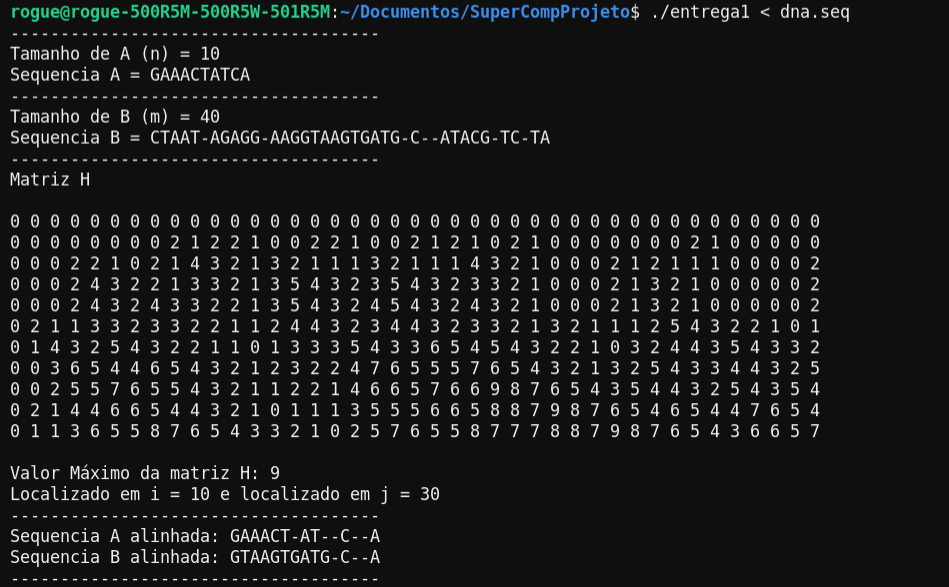

Projetos de Supercomputação do 1o. Semestre/2022

# Parte 1 - Heurística de Alinhamento Local de Smith-Waterman

Basicamente a premissa desse projeto é construir um algoritmo ingênuo para fazer o alinhamento local de duas sequencias de DNA. A heurística sequencial escolhida foi a de Smith e Waterman.

Primeiramente foi feito a contrução de uma Matriz H com scores que indicam um nivel de similaridade entre as sequências. Esse valores de score foram construidos de acordo com acertos(match) e erros(gap e mismatch), dess modo os acertos contribuem positvamente com o score e os erros negativamente.

Essa Matriz H de alinhamento não é composta puramente por valores inteiros de score, ela na verdade é composta por elementos que contem propriedades de score e movimento utilizado para chegar da posição anterior até sua poisção atual. Entre esses movimentos estão três opções: Diagonal , salto para baixo e salto para a direita. Com a matriz H contstruida conseguimos achar o maior valor de score nela, que será importante para prosseguir.

Logo depois, partindo do elemento da Matriz H com o maior score, traçamos o caminho contrário até chegar num elemento que tenha o score com valor 0, como cada elemento da matriz possui uma propriedade de movimento, fica fácil traçar esse caminho, que é o caminho reverso percorrido para o alinhamento local ótimo, já que ele parte do maior valor da matriz H.

Ao mesmo passo que esse caminho é criado já é possível iniciar a construição das sequências de DNA alinhadas com base nos movimentos utilizados por cada nó , Diagonal implica alinhamento (houve match), salto para baixo implica deleção ("-" na sequencia B) e salto para a direita implica inserção ("-" na sequencia A). Após isso é importante lembrar que como o caminho percorrido foi o inverso, para que as sequências alinhadas fiquem corretas é necessário invertê-las.

Abaixo pode-se ver a saida do programa com duas Sequencias de DNA diferentes:

Sequencias AGCACACA e ACACACTA

Sequencias GAAACTATCA e CTAAT-AGAGG-AAGGTAAGTGATG-C--ATACG-TC-TA

